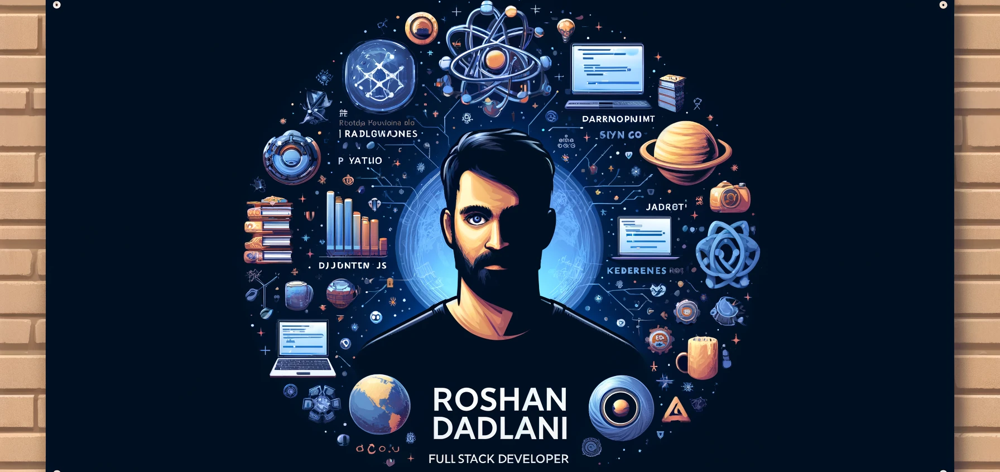

# Hi there, I'm Roshan Dadlani! 👋

I'm currently pursuing a Master of Science in Information Systems at Northeastern University, specializing in Data Science, Web Design, and Application Engineering. Passionate about developing innovative solutions to complex problems, I have a strong foundation in full-stack development, cloud computing, and data management.

## Skills

## Experience
### Fidelity Investments, Boston, MA
- Full Stack Engineer, Co-op (Jul 2023 – Dec 2023)

### Weddingz Bell Pvt. Ltd., Pune, India
- Co-Founder, Hiring Manager, Full Stack Web Developer (Dec 2020 – Mar 2023)

### eWebsuite Technologies Pvt. Ltd., Mumbai, India
- Full Stack Web Developer Intern (Sep 2020 – Nov 2020)

## Projects
- **[PharmaCutieCal – React.js, JavaScript, Flask, Python, MongoDB](https://github.com/TFC-Civic-Tech-Hackathon/drug-effects-predictor)** - TFC Hackathon Winner.
- **[QuickShare & SocketShare – Go-Lang, JavaScript, WebSocket, WebRTC](https://youtu.be/BTKFaxpgp68)** - Real-time file-sharing applications.
- **[Deppy: Your Virtual Companion – Tensorflow, Web Scraping, Python, Django](https://github.com/ROSDAD/Dr.-Deppy)** - AI chatbot web app for depression support.

## Certifications
- [Microsoft Certified: Azure Data Fundamentals](https://www.credly.com/badges/c3f1f726-f007-4661-89b3-ac9365863952/public_url)
- [Microsoft Certified: Azure Fundamentals](https://www.credly.com/badges/129ab566-be35-42c9-bad8-30c95e55e955/public_url)

## Activities and Awards
- Chairperson, Managing Secretary – Indian Society for Technical Education (Aug 2020 – May 2022)

Let's connect!

<!--
**ROSDAD/ROSDAD** is a ✨ _special_ ✨ repository because its `README.md` (this file) appears on your GitHub profile.

Here are some ideas to get you started:

- 🔭 I’m currently working on ...
- 🌱 I’m currently learning ...
- 👯 I’m looking to collaborate on ...
- 🤔 I’m looking for help with ...
- 💬 Ask me about ...
- 📫 How to reach me: ...
- 😄 Pronouns: ...
- ⚡ Fun fact: ...
-->
